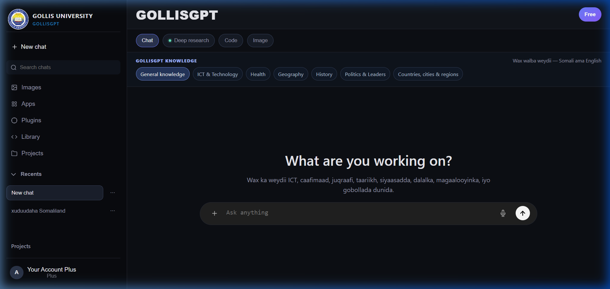

# GOLLISGPT - Artificial Intelligence Chat Interface

**GOLLISGPT** is an advanced, highly interactive, and bilingual (Somali & English) AI Chat Interface designed specifically for the students and academic community of **Gollis University**. It provides a robust and dynamic platform that merges AI-assisted capabilities with specialized offline databases and API integrations, empowering users to explore academic topics, learn coding, and generate multimedia content.

**Repository Link:** [https://github.com/aabdifataax4-star/GOLLISGPT](https://github.com/aabdifataax4-star/GOLLISGPT)

---

## 🚀 Detailed Project Information & Features

GOLLISGPT serves as a multifaceted digital assistant, meticulously architected with HTML, CSS, and Vanilla JavaScript. It offers an elegant "dark-mode only" interface that feels modern and professional.

**Core Capabilities Include:**
1. **Intelligent Chat System**: A comprehensive AI chat interface capable of handling prompts in both Somali and English. It is specifically fine-tuned with knowledge about ICT, Health, Geography, History, Politics, and specific regions.
2. **Offline Code Library**: A built-in repository containing syntax schemas and methodologies for multiple programming languages (Python, PHP, C#, JavaScript, Node.js). Users can seamlessly copy and paste code directly from the UI without an internet connection.
3. **Image Generation System**: Integrated tools that connect directly to external APIs (OpenRouter) allowing users to dynamically generate, view, and manage (including deleting) generated images entirely within the web environment.
4. **Plugins & Apps Gallery**: A customized search and category-driven plugin library showcasing a modernized suite of third-party capabilities, featuring deep-research functionality and interactive plugins.
5. **Dynamic UI/UX Architecture**: Features a responsive sidebar, seamless modal windows, contextual hover effects, user account settings, and project history retention.

---

## 👥 Group Members (Group 1)

This project has been collaboratively built and successfully presented by the following team members (Group 1):

- **Abdifatah Ali odowa**
- **Saalim Ahmed ibraahim**
- **Cabdiqani Maxamuud muuse**
- **Axmed Xasan Axmed**
- **Mohamed Abdirashiid hussein**
- **Mohamed Mohamuud Yuusuf**
- **Nagiib Ahmed Yuusuf**
- **Mohamed Abdirahmaan ahmed**

---

## 🛠️ How to run the website

GOLLISGPT is designed as a client-side web application, meaning setup is incredibly straightforward and does not require complex backend databases or continuous local-host servers for its core UI.

1. **Download / Clone the Repository**: 
   Ensure you have the entire project folder which contains the structural files (`index.html`, `style.css`, `script.js`, etc.) and the necessary multimedia assets (images & logos).
   ```bash
   git clone https://github.com/aabdifataax4-star/GOLLISGPT.git
   ```
2. **Open the Project Folder**:
   Navigate into the downloaded **GOLLISGPT** folder on your operating system.
3. **Launch the Application**:
   Simply **double-click** the `index.html` file, or right-click and open it with any modern web browser (e.g., Google Chrome, Microsoft Edge, Safari).
4. **Usage**:
   - Begin a **New Chat** to interact with the AI.
   - Use the **left sidebar** to access the *Code Library*, *Plugins*, and *Image Generation* modules.
   - You can also add customized API keys via the **Account Settings** (avatar at the bottom left) for live connections.

---

## 📸 System Screenshots & Video Demo

To give you a glimpse of how GOLLISGPT operates, here is an interactive walkthrough and the visual layout of the system.

### 🌟 System Video Demonstration
*(Watch the full recorded video of the system presentation demonstrating all features. The video is approximately 28 minutes long.)*
[**Watch the Full GOLLISGPT System Presentation Video Here**](https://drive.google.com/file/d/1DhsR8KavZrRVcw3Y2GMJQsIvdbTkrBg5/view?usp=sharing)

### 🖼️ System Interface Screenshot
*(A 100% full-screen view of the application running smoothly in the browser.)*


---
*Developed with ❤️ at Gollis University by Group 1.*
